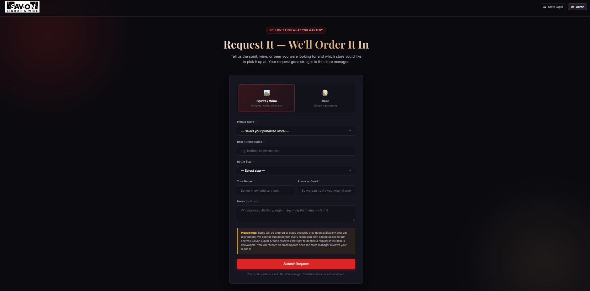

# Customer Request System — for Liquor, Wine & Beer Retailers

A single-page web app that lets customers request out-of-stock spirits, wine, and beer at any of a retailer's store locations, with separate portals for store managers and an admin, automated customer notifications, and weekly digests. **White-label ready** — any liquor retailer can rebrand the entire system by editing one `BRAND` config block.

No servers, no databases to maintain, **$0/month operating cost.**

> **Live demo (Savon Liquor & Wine deployment):** [customerrequestform.netlify.app](https://customerrequestform.netlify.app/)
> **Built by:** [Savon Nexo LLC](https://www.savonnexo.com)
> **Version:** 1.2 — White-label edition



> Drop `screenshot.png` of your customer form into the repo root for a stronger first impression. (Add it via Add file → Upload files on GitHub.)

---

## What it does

- **Customer request form** — pick a store, tell us what you're looking for (spirits, wine, or beer), leave your name, email, and phone.
- **Instant store notification** — the moment a customer submits a request, the store's manager email gets a full request summary and all admin emails are CC'd.
- **Store portal** — each store logs in to see only their own requests. Mark items `Pending → Ordered`, `Fulfilled`, or `Not Available` with a required reason or expected date. The customer is emailed automatically when status changes.
- **Admin portal** — see every request across every store. Add or remove stores, manage the master notification email list, manually fire weekly digests.
- **Audit log** — every status change is timestamped and attributed in a sheet, then summarised in a Sunday-night master change-log email to all admin addresses.
- **Stale-pending alerts** — any request stuck on Pending for 7+ days surfaces on a Monday morning alert to all admin emails.
- **Multi-recipient store emails** — store address field accepts `;` or `,` separators (e.g. `manager@x.com;owner@y.com`) so multiple people can receive store-level mail.

---

## White-label / resellable

This codebase is built so any liquor/wine/beer retailer can rebrand it in **5 minutes** by editing one `BRAND` block in `index.html` and the matching block in `apps_script.gs`. Customisable: store name, hero copy, logo, primary accent colour, secondary accent, page background, footer attribution, every email's subject and body.

See [BRANDING.md](BRANDING.md) for the full guide and example colour presets.

---

## Tech stack

| Layer        | Tech                                                              |
|--------------|-------------------------------------------------------------------|
| Front-end    | Vanilla HTML / CSS / JS (single file, no build, no framework)      |
| Backend      | Google Apps Script Web App (`doGet` + `doPost`, JSON over HTTP)    |
| Database     | Google Sheets (4 tabs: Requests, Stores, AdminEmails, AuditLog)    |
| Email        | `MailApp.sendEmail()` (free, no third-party service)               |
| Scheduling   | Apps Script time-driven triggers                                   |
| Hosting      | Static page on Netlify (or any static host: GitHub Pages, Vercel)  |

---

## Repository layout

```
.
├── index.html        # The whole front-end app
├── apps_script.gs    # Paste into your Google Sheet's Apps Script editor
├── logo.png          # Drop your transparent-PNG logo here
├── README.md         # This file
├── SETUP.md          # Step-by-step deployment guide
├── BRANDING.md       # White-label customisation guide
├── CHANGELOG.md      # Version history
├── LICENSE           # MIT
└── .gitignore
```

---

## Quick start

**Try locally (Demo mode, no setup):**
1. Clone the repo.
2. Open `index.html` in any browser — admin password is `CHANGE_ME` (set in the source), store passwords default to the lowercase store name. Data lives in the browser's `localStorage` until you wire up the backend.

**Go live (~10 minutes):** see [SETUP.md](SETUP.md). The short version:
1. Create a Google Sheet, open Apps Script, paste `apps_script.gs`, run `firstTimeSetup`.
2. Deploy as a Web App, copy the URL.
3. Paste the URL into the `WEB_APP_URL` constant at the top of `index.html`.
4. Change `ADMIN_PASSWORD` from `CHANGE_ME` to something strong.
5. Add three time-driven triggers (`sendWeeklyDigest`, `sendMasterChangeLog`, `checkStalePending`).
6. Host `index.html` + `logo.png` on Netlify or any static host.

**Rebrand for a different retailer:** see [BRANDING.md](BRANDING.md). Edit one `BRAND` block in each file. About 5 minutes.

---

## Customisation

- **Brand identity (white-label):** edit the `BRAND` block at the top of `index.html` and `apps_script.gs`. See [BRANDING.md](BRANDING.md).
- **Admin password:** change `CONFIG.ADMIN_PASSWORD` in `index.html`.
- **Stale-pending threshold:** edit `STALE_PENDING_DAYS` in `apps_script.gs` (default 7).
- **Initial stores (demo only):** edit `CONFIG.INITIAL_STORES` in `index.html` and the seed block in `firstTimeSetup` in `apps_script.gs`.

---

## License

MIT — see [LICENSE](LICENSE).

Commercial use, modification, and redistribution are all permitted. Originally built by [Savon Nexo LLC](https://www.savonnexo.com) for Savon Liquor & Wine.
